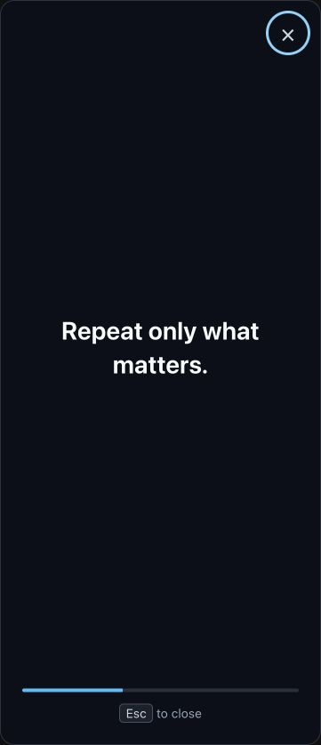

# Signal Repeat for RemNote

> Repeat only what matters.

Signal Repeat is a focused repetition plugin for RemNote. It temporarily places
one selected passage, focused Rem, or revealed flashcard answer in a quiet,
full-size view for 10–30 seconds, then returns you to your learning flow. It does
not replace RemNote's spaced-repetition scheduler.



## Installation

Signal Repeat v0.1.1 targets RemNote Web and Desktop. Mobile activation is not
enabled. After the plugin is published, open **Settings → Plugins** in RemNote,
find **Signal Repeat**, and install it. Release candidates are distributed as
`signal-repeat-remnote-v<version>.zip` on this repository's GitHub Releases page.

## Usage

### Selected text

1. Select the exact text you want to repeat.
2. Open **… → Search & Plugins → Signal Repeat** in the selection toolbar.
3. Choose **Repeat in focus**.

The popup displays only the selected range. On hosts where the Selected Text
menu is unavailable, use the keyboard shortcut below.

### Flashcard answer

1. Reveal a forward or reverse flashcard answer.
2. Choose **Repeat · 15s** below the answer.

The control is hidden before the answer is revealed. Cloze-answer extraction is
outside the v0.1.0 scope and safely produces a target-missing notification.
Signal Repeat never rates the card or changes its schedule.

Multi-line answers are enabled only when the public SDK identifies the exact
card and answer shape. A forward Set uses its ordered direct card-item children;
a backward multi-line card uses its immediate parent text. List, Partial,
recursive, and missing-card-ID cases remain disabled and show a fixed
unsupported-card notification instead of guessing from the parent Rem.

### Keyboard shortcut

Press **Option+M** on macOS or **Alt+M** on Windows/Linux. The command resolves
targets in this order: selected text, revealed flashcard answer, then focused
Rem. If none is available, RemNote shows a fixed notification and no popup.

Press **Esc** or the close button to end a session early. Otherwise it closes
automatically when its timer completes and restores focus to RemNote.

Signal Repeat preserves supported RemNote RichText in the focus session,
including formatting, links, Rem references, LaTeX, audio/video, and images.
Text, references, LaTeX, and images use RemNote's official read-only RichText
viewer. Audio/video uses a local, keyboard-accessible play/pause control and is
never autoplayed by Signal Repeat.

## Settings

Open **Settings → Plugin Settings → Signal Repeat** to configure:

- repeat duration: 10, 15 (default), 20, or 30 seconds;
- progress bar visibility;
- close-hint visibility.

## Privacy and permissions

Signal Repeat processes learning content only inside the RemNote plugin
environment. It:

- adds no upload, tracking, or media-fetching service of its own;
- renders only the existing media URL supplied in RemNote RichText and adds no
  `fetch`/XHR path;
- does not log or persist selected text, Rem text, or flashcard answers;
- stores only plugin preferences through RemNote's settings API;
- requests read-only access and does not modify Rem content, ratings, queues, or
  scheduling data.

## Development

Install [Mise](https://mise.jdx.dev/), then run:

```sh
mise install
mise run setup
mise run dev
```

Before submitting a change, run the same gates as CI:

```sh
mise run typecheck
mise run test
mise run build
```

The build validates the manifest and creates a versioned archive such as
`signal-repeat-remnote-v0.1.1.zip`, using the version in `package.json`. See
[`docs/development.md`](docs/development.md) for the test and integration
workflow and [`docs/architecture.md`](docs/architecture.md) for module
boundaries.

## Contributing

Read [`CONTRIBUTING.md`](CONTRIBUTING.md) and the product source of truth,
[`Signal-Repeat-SPECIFICATION.md`](Signal-Repeat-SPECIFICATION.md), before
opening a change. Security reports follow [`SECURITY.md`](SECURITY.md).

## License

Signal Repeat is available under the [MIT License](LICENSE).
